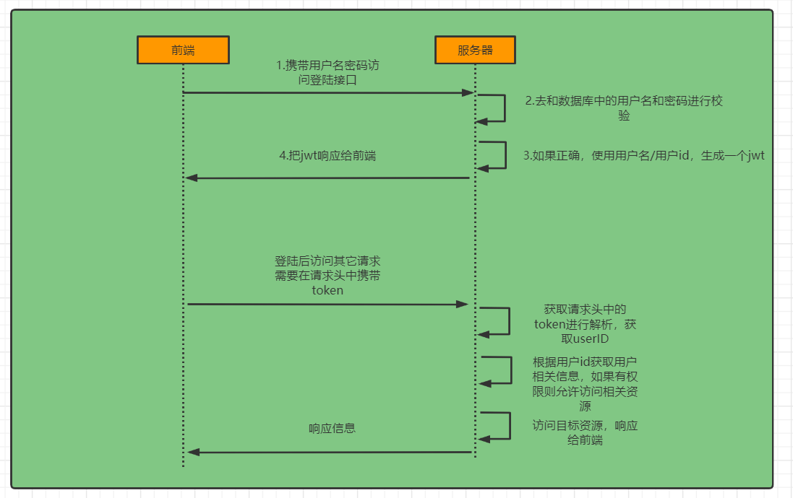

# springboot2.7整合springSecurity

## 0.简介

本着前人栽树，后人乘凉的这种思想，自己花了一些时间，用心的整理了一套springboot整合springsecurity的教程。

该教程是基于springboot2.7.3版本开发的，在2.7以上版本中，springSecurity已经废弃了WebSecurityConfigurerAdapter，而是使用 bean 注入的方式，详情可参阅官方文档：https://spring.io/blog/2022/02/21/spring-security-without-the-websecurityconfigureradapter#ldap-authentication


该教程是基于前后端分离，会实现以下两种登录功能：

1. **用户名+密码+图片验证码**
2. **手机号登录**

这两种方式可以同时存在，并且互不干预。

本教程会通过阅读其内置的用户名密码登录的**源码**，以及结合**官网文档**来实现一些自定义的登录方式。

**注：教程主要是开发思路的讲解，其中涉及到的代码仅供参考，为了方便，很多地方忽略了一些细节**


## 1.快速开始

### 1.1创建工程

创建一个名为springsecurity的工作，springboot的版本选择2.7.3


### 1.2引入springsecurity依赖

```xml
<dependencies>
    <dependency>
        <groupId>org.springframework.boot</groupId>
        <artifactId>spring-boot-starter-web</artifactId>
    </dependency>

    <!--security依赖-->
    <dependency>
        <groupId>org.springframework.boot</groupId>
        <artifactId>spring-boot-starter-security</artifactId>
    </dependency>

    <!--测试相关-->
    <dependency>
        <groupId>org.springframework.boot</groupId>
        <artifactId>spring-boot-starter-test</artifactId>
        <scope>test</scope>
    </dependency>
</dependencies>
```

启动程序，在浏览器中输入localhost:你的端口号，就会出现如下的界面


输入用户名和密码即可登录，这里的用户名默认是user，密码则会打印在控制台上


## 2.原理初探

### 2.1springSecurity的作用

**Spring Security是一个提供了认证、授权和防止常见攻击的框架**。

认证：验证当前访问系统的是不是本系统的用户，简单的讲就是登录

授权：经过认证的用户是否有权限进行某个操作


### 2.2springSecurity的本质

springSecurity提供了许多基础的过滤器，当客户端向应用发送请求，会经过容器中已经创建一个过滤链(许多过滤器)，如图：


springSecurity内置了哪些过滤器？


这是官方文档截图的一部分，详细的可以看官方文档：

https://docs.spring.io/spring-security/reference/5.7.3/servlet/architecture.html


另外我们在启动程序的时候，也可以看到springSecurity创建了哪些过滤器：


### 2.3表单登录流程

一般前后端不分离的项目，登录流程如图


用户提交用户名和密码，服务器会进行用户名密码比对，如果失败，会跳转到登录页，重新登录，如果成功，会把用户信息保存到session中，并且跳转到能访问的首页


### 2.4走进源码

阅读哪一块的源码？怎么入手？


从官方文档的截图，从图可以知道，用户名密码验证的主要是从**UsernamePasswordAuthenticationFilter**这个过滤器开始的。


### 2.5AbstractAuthenticationProcessingFilter

打开源码可以看到**UsernamePasswordAuthenticationFilter**是继承**AbstractAuthenticationProcessingFilter**，因此我们就从它开始阅读。

**AbstractAuthenticationProcessingFilter**是基于基于浏览器的HTTP身份验证请求的抽象处理器，实现了整个身份的验证过程，下面会阅读重点部分的代码

```java
private void doFilter(HttpServletRequest request, HttpServletResponse response, FilterChain chain)
			throws IOException, ServletException {
	//(1)如果不是登录验证请求，就直接放行，执行下一个过滤器
    if (!requiresAuthentication(request, response)) {
        chain.doFilter(request, response);
        return;
    }
    try {
        //(2)登录验证的核心方法，具体实现是在UsernamePasswordAuthenticationFilter
        Authentication authenticationResult = attemptAuthentication(request, response);
        if (authenticationResult == null) {
            return;
        }
        this.sessionStrategy.onAuthentication(authenticationResult, request, response);

        if (this.continueChainBeforeSuccessfulAuthentication) {
            chain.doFilter(request, response);
        }

        //(3)验证成功后的处理逻辑
        successfulAuthentication(request, response, chain, authenticationResult);
    }
    catch (InternalAuthenticationServiceException failed) {
        this.logger.error("An internal error occurred while trying to authenticate the user.", failed);
        unsuccessfulAuthentication(request, response, failed);
    }
    catch (AuthenticationException ex) {
        //(4)验证失败后的处理逻辑
        unsuccessfulAuthentication(request, response, ex);
    }
}
```

这一段代码是整个认证的核心，

(1)判断用户的请求是不是登录认证的请求，例如我们下面的认证接口"/admin/login"

(2)登录验证的核心方法，里面实现了用户名密码认证

(3)验证成功后的处理逻辑

(4)验证失败后的处理逻辑


我们先来分析一下**验证成功后的处理逻辑**

**successfulAuthentication方法**

```java
protected void successfulAuthentication(HttpServletRequest request, HttpServletResponse response, FilterChain chain,
       Authentication authResult) throws IOException, ServletException {
    //(1)SecurityContextHolder类很重要，主要是创建一个线程池保存用户信息，后面接口要使用到用户信息时就可以通过这个类去获取
    SecurityContext context = SecurityContextHolder.createEmptyContext();
    context.setAuthentication(authResult);
    SecurityContextHolder.setContext(context);
    this.securityContextRepository.saveContext(context, request, response);
    if (this.logger.isDebugEnabled()) {
        this.logger.debug(LogMessage.format("Set SecurityContextHolder to %s", authResult));
    }
    //这里是记住登录状态的功能
    this.rememberMeServices.loginSuccess(request, response, authResult);
    if (this.eventPublisher != null) {
        this.eventPublisher.publishEvent(new InteractiveAuthenticationSuccessEvent(authResult, this.getClass()));
    }
    //(2)登录成功后的相关处理，例如跳转到首页
    this.successHandler.onAuthenticationSuccess(request, response, authResult);
}
```

我们可以看看**this.successHandler**是什么，

```java
private AuthenticationSuccessHandler successHandler = new SavedRequestAwareAuthenticationSuccessHandler();

private AuthenticationFailureHandler failureHandler = new SimpleUrlAuthenticationFailureHandler();
```

我们可以看到**this.successHandler**初始化值是SavedRequestAwareAuthenticationSuccessHandler，我们进这个类看看onAuthenticationSuccess方法

```java
@Override
public void onAuthenticationSuccess(HttpServletRequest request, HttpServletResponse response,
                                    Authentication authentication) throws ServletException, IOException {
    SavedRequest savedRequest = this.requestCache.getRequest(request, response);
    if (savedRequest == null) {
        super.onAuthenticationSuccess(request, response, authentication);
        return;
    }
    String targetUrlParameter = getTargetUrlParameter();
    if (isAlwaysUseDefaultTargetUrl()
        || (targetUrlParameter != null && StringUtils.hasText(request.getParameter(targetUrlParameter)))) {
        this.requestCache.removeRequest(request, response);
        super.onAuthenticationSuccess(request, response, authentication);
        return;
    }
    clearAuthenticationAttributes(request);
    // Use the DefaultSavedRequest URL
    String targetUrl = savedRequest.getRedirectUrl();
    getRedirectStrategy().sendRedirect(request, response, targetUrl);
}
```

这段逻辑主要是登录成功后跳转到哪一个页面。

之所以会讲这一段，主要是因为我们后面自定义自己的登录方式会涉及到。例如前后端登录成功后，使用redis保存用户信息以及生产一窜token返回给前端。

这时我们可以参考SavedRequestAwareAuthenticationSuccessHandler，创建自己的AuthenticationSuccessHandler，然后赋值给**this.successHandler**

验证失败后的处理逻辑这块就不讲源码了，它的原理跟成功是一样的，后面我们自定义一个失败的handler去替换就好。


### 2.6UsernamePasswordAuthenticationFilter

UsernamePasswordAuthenticationFilter是继承AbstractAuthenticationProcessingFilter这个抽象类的，里面有一个非常重要的方法attemptAuthentication，里面实现了身份验证处理的逻辑

```java
@Override
public Authentication attemptAuthentication(HttpServletRequest request, HttpServletResponse response)
    throws AuthenticationException {
    //(1)判断是否是post提交
    if (this.postOnly && !request.getMethod().equals("POST")) {
        throw new AuthenticationServiceException("Authentication method not supported: " + request.getMethod());
    }
    String username = obtainUsername(request);
    username = (username != null) ? username.trim() : "";
    String password = obtainPassword(request);
    password = (password != null) ? password : "";
    //(2)根据用户名和密码生成一个身份认证令牌，其实就是保存一些用户登录的信息
    UsernamePasswordAuthenticationToken authRequest = UsernamePasswordAuthenticationToken.unauthenticated(username,
                                                                                                          password);
    setDetails(request, authRequest);
    //(3)调用这个AuthenticationManager接口类中的authenticate验证接口
    return this.getAuthenticationManager().authenticate(authRequest);
}
```

根据用户名和密码生成一个身份认证令牌，然后把令牌传到 AuthenticationManager 进行验证。我们先来看看

**UsernamePasswordAuthenticationToken**

```java
public class UsernamePasswordAuthenticationToken extends AbstractAuthenticationToken {

	private static final long serialVersionUID = SpringSecurityCoreVersion.SERIAL_VERSION_UID;
	//用户信息
	private final Object principal;
	//用户凭证
	private Object credentials;
	
	public UsernamePasswordAuthenticationToken(Object principal, Object credentials) {
		super(null);
		this.principal = principal;
		this.credentials = credentials;
		setAuthenticated(false);
	}

	public UsernamePasswordAuthenticationToken(Object principal, Object credentials,
			Collection<? extends GrantedAuthority> authorities) {
        //这里是权限信息
		super(authorities);
		this.principal = principal;
		this.credentials = credentials;
		super.setAuthenticated(true);
	}
	
    //(1)第一次验证时调用这个方法
	public static UsernamePasswordAuthenticationToken unauthenticated(Object principal, Object credentials) {
		return new UsernamePasswordAuthenticationToken(principal, credentials);
	}
	
    //(2)已经验证过后可以调用此方法
	public static UsernamePasswordAuthenticationToken authenticated(Object principal, Object credentials,
			Collection<? extends GrantedAuthority> authorities) {
		return new UsernamePasswordAuthenticationToken(principal, credentials, authorities);
	}
}
```

这个类比较意思，principal和credentials数据类型是object，接着往下看，后面会有我们的答案。


现在重点看看**this.getAuthenticationManager().authenticate(authRequest)**

我们打开AuthenticationManager

```java
public interface AuthenticationManager {
	Authentication authenticate(Authentication authentication) throws AuthenticationException;
}
```

这只是一个接口，其实现是在ProviderManager


### 2.7ProviderManager

springsecurity会提供许多AuthenticationProvider，而ProviderManager这个类就处理这些AuthenticationProvider

```java
public class ProviderManager implements AuthenticationManager, MessageSourceAware, InitializingBean {
    @Override
	public Authentication authenticate(Authentication authentication) throws AuthenticationException {
		Class<? extends Authentication> toTest = authentication.getClass();
		AuthenticationException lastException = null;
		AuthenticationException parentException = null;
		Authentication result = null;
		Authentication parentResult = null;
		int currentPosition = 0;
		int size = this.providers.size();
        //在容器启动时，springsecurity已经初始化了一些provider，其中就有DaoAuthenticationProvider，其主要是用户名和密码验证的
		for (AuthenticationProvider provider : getProviders()) {
			if (!provider.supports(toTest)) {
                //如果provider不支持UsernamePasswordAuthenticationToken，就跳到下一个provider
				continue;
			}
			if (logger.isTraceEnabled()) {
				logger.trace(LogMessage.format("Authenticating request with %s (%d/%d)",
						provider.getClass().getSimpleName(), ++currentPosition, size));
			}
			try {
                //(1)DaoAuthenticationProvider就是这个provider
				result = provider.authenticate(authentication);
				if (result != null) {
					copyDetails(authentication, result);
					break;
				}
			}
			catch (AccountStatusException | InternalAuthenticationServiceException ex) {
				prepareException(ex, authentication);
				throw ex;
			}
			catch (AuthenticationException ex) {
				lastException = ex;
			}
		}
		if (result == null && this.parent != null) {
			try {
				parentResult = this.parent.authenticate(authentication);
				result = parentResult;
			}
			catch (ProviderNotFoundException ex) {
			}
			catch (AuthenticationException ex) {
				parentException = ex;
				lastException = ex;
			}
		}
		if (result != null) {
			if (this.eraseCredentialsAfterAuthentication && (result instanceof CredentialsContainer)) {
				((CredentialsContainer) result).eraseCredentials();
			}
			if (parentResult == null) {
				this.eventPublisher.publishAuthenticationSuccess(result);
			}

			return result;
		}

		if (lastException == null) {
			lastException = new ProviderNotFoundException(this.messages.getMessage("ProviderManager.providerNotFound",
					new Object[] { toTest.getName() }, "No AuthenticationProvider found for {0}"));
		}
		if (parentException == null) {
			prepareException(lastException, authentication);
		}
		throw lastException;
	}
}
```

这个类的内容不是重点，重点是这个DaoAuthenticationProvider，而它又是继承AbstractUserDetailsAuthenticationProvider这个抽象类，因此我们先来了解一下它

```java
public abstract class AbstractUserDetailsAuthenticationProvider
		implements AuthenticationProvider, InitializingBean, MessageSourceAware {
    	@Override
	public Authentication authenticate(Authentication authentication) throws AuthenticationException {
		Assert.isInstanceOf(UsernamePasswordAuthenticationToken.class, authentication,
				() -> this.messages.getMessage("AbstractUserDetailsAuthenticationProvider.onlySupports",
						"Only UsernamePasswordAuthenticationToken is supported"));
		String username = determineUsername(authentication);
		boolean cacheWasUsed = true;
        //(1)根据用户名从缓存中获取用户信息
		UserDetails user = this.userCache.getUserFromCache(username);
		if (user == null) {
			cacheWasUsed = false;
			try {
                //(2)调用实现类的DaoAuthenticationProvider的retrieveUser，这里会得到保存在内存中的用户信息，如密码，账号状态等
				user = retrieveUser(username, (UsernamePasswordAuthenticationToken) authentication);
			}
			catch (UsernameNotFoundException ex) {
				this.logger.debug("Failed to find user '" + username + "'");
				if (!this.hideUserNotFoundExceptions) {
					throw ex;
				}
				throw new BadCredentialsException(this.messages
						.getMessage("AbstractUserDetailsAuthenticationProvider.badCredentials", "Bad credentials"));
			}
			Assert.notNull(user, "retrieveUser returned null - a violation of the interface contract");
		}
		try {
           	//(3)判断用户状态，是否是启用
			this.preAuthenticationChecks.check(user);
            //(4)密码比较
			additionalAuthenticationChecks(user, (UsernamePasswordAuthenticationToken) authentication);
		}
		catch (AuthenticationException ex) {
			if (!cacheWasUsed) {
				throw ex;
			}
			// There was a problem, so try again after checking
			// we're using latest data (i.e. not from the cache)
			cacheWasUsed = false;
			user = retrieveUser(username, (UsernamePasswordAuthenticationToken) authentication);
			this.preAuthenticationChecks.check(user);
			additionalAuthenticationChecks(user, (UsernamePasswordAuthenticationToken) authentication);
		}
		this.postAuthenticationChecks.check(user);
		if (!cacheWasUsed) {
			this.userCache.putUserInCache(user);
		}
		Object principalToReturn = user;
		if (this.forcePrincipalAsString) {
			principalToReturn = user.getUsername();
		}
        //(5)创建一个成功的Authentication对象
		return createSuccessAuthentication(principalToReturn, authentication, user);
	}
}
```

这里面实现的逻辑是这样的

(2)调用实现类的DaoAuthenticationProvider的retrieveUser，获取到保存在内存中的用户信息，如密码，账号状态等

(3)判断用户状态是否有效

(4)获取的密码跟提交过来的密码是否一致


打开DaoAuthenticationProvider，再看看retrieveUser

```java
public class DaoAuthenticationProvider extends AbstractUserDetailsAuthenticationProvider {
	@Override
	protected final UserDetails retrieveUser(String username, UsernamePasswordAuthenticationToken authentication)
			throws AuthenticationException {
		prepareTimingAttackProtection();
		try {
            //最终实现查询用户信息的代码在这里
			UserDetails loadedUser = this.getUserDetailsService().loadUserByUsername(username);
			if (loadedUser == null) {
				throw new InternalAuthenticationServiceException(
						"UserDetailsService returned null, which is an interface contract violation");
			}
			return loadedUser;
		}
		catch (UsernameNotFoundException ex) {
			mitigateAgainstTimingAttack(authentication);
			throw ex;
		}
		catch (InternalAuthenticationServiceException ex) {
			throw ex;
		}
		catch (Exception ex) {
			throw new InternalAuthenticationServiceException(ex.getMessage(), ex);
		}
	}
}
```

虽然这里的代码很多，但简单来讲就是调用UserDetailsService里面的loadUserByUsername接口查询用户信息，然后进行密码校验。

因此后面我们在做手机登录的时候，就可以自定义一个provider,然后调用一个根据手机号查询用户信息的接口即可。

接下来重点看看这一段

```java
//最终实现查询用户信息的代码在这里
UserDetails loadedUser = this.getUserDetailsService().loadUserByUsername(username);
```


### 2.8InMemoryUserDetailsManager

```java
public interface UserDetailsService {
	UserDetails loadUserByUsername(String username) throws UsernameNotFoundException;
}
```

loadUserByUsername是接口UserDetailsService里面的一个方法，是通过用户名获取用户信息，其实现是在**InMemoryUserDetailsManager**

```java
public class InMemoryUserDetailsManager implements UserDetailsManager, UserDetailsPasswordService {
    @Override
	public UserDetails loadUserByUsername(String username) throws UsernameNotFoundException {
        //(1)从缓存中获取用户信息
		UserDetails user = this.users.get(username.toLowerCase());
		if (user == null) {
			throw new UsernameNotFoundException(username);
		}
        //(2)返回一个UserDetails
		return new User(user.getUsername(), user.getPassword(), user.isEnabled(), user.isAccountNonExpired(),
				user.isCredentialsNonExpired(), user.isAccountNonLocked(), user.getAuthorities());
	}
}
```

springSecurity获取用户信息，默认从缓存中换取的，然后返回一个UserDetails，我们看看其定义的User类，下面只是列出用部分

```java
public class User implements UserDetails, CredentialsContainer {
    private static final long serialVersionUID = SpringSecurityCoreVersion.SERIAL_VERSION_UID;

	private static final Log logger = LogFactory.getLog(User.class);
	
	private String password;

	private final String username;

	private final Set<GrantedAuthority> authorities;

	private final boolean accountNonExpired;

	private final boolean accountNonLocked;

	private final boolean credentialsNonExpired;

	private final boolean enabled;


	public User(String username, String password, Collection<? extends GrantedAuthority> authorities) {
		this(username, password, true, true, true, true, authorities);
	}

	public User(String username, String password, boolean enabled, boolean accountNonExpired,
			boolean credentialsNonExpired, boolean accountNonLocked,
			Collection<? extends GrantedAuthority> authorities) {
		Assert.isTrue(username != null && !"".equals(username) && password != null,
				"Cannot pass null or empty values to constructor");
		this.username = username;
		this.password = password;
		this.enabled = enabled;
		this.accountNonExpired = accountNonExpired;
		this.credentialsNonExpired = credentialsNonExpired;
		this.accountNonLocked = accountNonLocked;
		this.authorities = Collections.unmodifiableSet(sortAuthorities(authorities));
	}

	@Override
    //权限
	public Collection<GrantedAuthority> getAuthorities() {
		return this.authorities;
	}
}
```

首先这个类继承UserDetails了，定义了一些基本信息，最重要的是用户名、密码、权限。

后面我们会重写这部分逻辑，我们会重写loadUserByUsername，使其查询我们的数据库。


### 2.9SecurityContextPersistenceFilter

当登录成功后，再次发送请求时，springsecurity时如何知道该用户已经通过验证的？

这时我们就要认识一下**SecurityContextPersistenceFilter**

它的作用主要是： 创建SecurityContext安全上下文信息和请求结束时清空SecurityContextHolder 

接下来看源码

```java
@Deprecated
public class SecurityContextPersistenceFilter extends GenericFilterBean {
    @Override
	public void doFilter(ServletRequest request, ServletResponse response, FilterChain chain)
			throws IOException, ServletException {
		doFilter((HttpServletRequest) request, (HttpServletResponse) response, chain);
	}

	private void doFilter(HttpServletRequest request, HttpServletResponse response, FilterChain chain)
			throws IOException, ServletException {
		//(1)同一个请求只处理一次
		if (request.getAttribute(FILTER_APPLIED) != null) {
			chain.doFilter(request, response);
			return;
		}
		request.setAttribute(FILTER_APPLIED, Boolean.TRUE);
		if (this.forceEagerSessionCreation) {
            //(2)创建一个HttpSession
			HttpSession session = request.getSession();
			if (this.logger.isDebugEnabled() && session.isNew()) {
				this.logger.debug(LogMessage.format("Created session %s eagerly", session.getId()));
			}
		}
		HttpRequestResponseHolder holder = new HttpRequestResponseHolder(request, response);
        //(3)获取登录用户的相关信息，如果没有登录，用户信息为空
		SecurityContext contextBeforeChainExecution = this.repo.loadContext(holder);
		try {
            //(4)SecurityContextHolder绑定SecurityContext对象
			SecurityContextHolder.setContext(contextBeforeChainExecution);
			if (contextBeforeChainExecution.getAuthentication() == null) {
				logger.debug("Set SecurityContextHolder to empty SecurityContext");
			}
			else {
				if (this.logger.isDebugEnabled()) {
					this.logger
							.debug(LogMessage.format("Set SecurityContextHolder to %s", contextBeforeChainExecution));
				}
			}
            //(5)下一个过滤器处理
			chain.doFilter(holder.getRequest(), holder.getResponse());
		}
		finally {
			SecurityContext contextAfterChainExecution = SecurityContextHolder.getContext();
			// (5)在任何其他操作之前删除SecurityContextHolder内容
			SecurityContextHolder.clearContext();
            //(6)重新保存用户信息
			this.repo.saveContext(contextAfterChainExecution, holder.getRequest(), holder.getResponse());
			request.removeAttribute(FILTER_APPLIED);
			this.logger.debug("Cleared SecurityContextHolder to complete request");
		}
	}
}
```

到现在为止，登录验证的主要源码已经介绍完毕，如果没有看明白，不要紧，只要有个印象就行，接下来自定义自己的登录接口时，会仿照其源码。


## 3.准备工作

### 3.1创建数据表

```sql
/*用户角色映射表*/
CREATE TABLE `sys_user_role`  (
  `id` bigint(20) UNSIGNED NOT NULL AUTO_INCREMENT,
  `user_id` bigint(200) NOT NULL COMMENT '用户id',
  `role_id` bigint(200) NOT NULL DEFAULT 0 COMMENT '角色id',
  PRIMARY KEY (`id`) USING BTREE
) ENGINE = InnoDB AUTO_INCREMENT = 2 CHARACTER SET = utf8mb4 COLLATE = utf8mb4_general_ci ROW_FORMAT = Dynamic;

/*用户表*/
CREATE TABLE `sys_user`  (
  `id` bigint(20) NOT NULL AUTO_INCREMENT COMMENT '主键',
  `user_name` varchar(64) CHARACTER SET utf8mb4 COLLATE utf8mb4_general_ci NOT NULL DEFAULT 'NULL' COMMENT '用户名',
  `nick_name` varchar(64) CHARACTER SET utf8mb4 COLLATE utf8mb4_general_ci NOT NULL DEFAULT 'NULL' COMMENT '昵称',
    `phone` varchar(64) CHARACTER SET utf8mb4 COLLATE utf8mb4_general_ci NOT NULL DEFAULT 'NULL' COMMENT '电话',
  `password` varchar(64) CHARACTER SET utf8mb4 COLLATE utf8mb4_general_ci NOT NULL DEFAULT 'NULL' COMMENT '密码',
  `status` char(1) CHARACTER SET utf8mb4 COLLATE utf8mb4_general_ci NULL DEFAULT '0' COMMENT '账号状态（0正常 1停用）',
  PRIMARY KEY (`id`) USING BTREE
) ENGINE = InnoDB AUTO_INCREMENT = 3 CHARACTER SET = utf8mb4 COLLATE = utf8mb4_general_ci COMMENT = '用户表' ROW_FORMAT = Dynamic;

/*角色菜单映射表*/
CREATE TABLE `sys_role_menu`  (
  `id` bigint(20) UNSIGNED NOT NULL AUTO_INCREMENT,
  `role_id` bigint(200) NOT NULL COMMENT '角色ID',
  `menu_id` bigint(200) NOT NULL DEFAULT 0 COMMENT '菜单id',
  PRIMARY KEY (`id`) USING BTREE
) ENGINE = InnoDB AUTO_INCREMENT = 2 CHARACTER SET = utf8mb4 COLLATE = utf8mb4_general_ci ROW_FORMAT = Dynamic;

/*角色表*/
CREATE TABLE `sys_role`  (
  `id` bigint(20) NOT NULL AUTO_INCREMENT,
  `role_name` varchar(128) CHARACTER SET utf8mb4 COLLATE utf8mb4_general_ci NULL DEFAULT NULL,
  PRIMARY KEY (`id`) USING BTREE
) ENGINE = InnoDB AUTO_INCREMENT = 2 CHARACTER SET = utf8mb4 COLLATE = utf8mb4_general_ci COMMENT = '角色表' ROW_FORMAT = Dynamic;

/*菜单表*/
CREATE TABLE `sys_menu`  (
  `id` bigint(20) NOT NULL AUTO_INCREMENT COMMENT '自增ID',
  `menu_name` varchar(64) CHARACTER SET utf8mb4 COLLATE utf8mb4_general_ci NOT NULL DEFAULT 'NULL' COMMENT '菜单名',
  `perms` varchar(100) CHARACTER SET utf8mb4 COLLATE utf8mb4_general_ci NULL DEFAULT NULL COMMENT '权限标识',
  PRIMARY KEY (`id`) USING BTREE
) ENGINE = InnoDB AUTO_INCREMENT = 2 CHARACTER SET = utf8mb4 COLLATE = utf8mb4_general_ci COMMENT = '菜单表' ROW_FORMAT = Dynamic;
```

新建一条用户数据：账号：test  密码：123456

```sql
INSERT INTO `springsecurity`.`sys_user`(`user_name`, `nick_name`, `password`, `phone`, `status`) VALUES ('test', '1', '$2a$12$pgFnH5Ot.XIvbaTM7X9nNe8AGwBV.3eggszusKShXXG2HJ1fFdNMO', '13662301000', '0');

```

### 3.2生成代码

本教程使用mybatis-plus

引入数据库相关依赖：

```xml
<!--操作mysql的相关依赖-->
<dependency>
    <groupId>com.baomidou</groupId>
    <artifactId>mybatis-plus-boot-starter</artifactId>
    <version>3.5.3</version>
</dependency>

<dependency>
    <groupId>com.mysql</groupId>
    <artifactId>mysql-connector-j</artifactId>
    <version>8.0.32</version>
</dependency>

<!--代码生成器相关依赖-->
<dependency>
    <groupId>com.baomidou</groupId>
    <artifactId>mybatis-plus-generator</artifactId>
    <version>3.5.3</version>
</dependency>

<dependency>
    <groupId>org.freemarker</groupId>
    <artifactId>freemarker</artifactId>
    <version>2.3.28</version>
</dependency>
```

配置：

```properties
server.port=8002

spring.datasource.driver-class-name=com.mysql.cj.jdbc.Driver
spring.datasource.url=jdbc:mysql://localhost:3306/springsecurity?Unicode=true&characterEncoding=utf8&serverTimezone=UTC
spring.datasource.username=root
spring.datasource.password=root
```

生成方法：

```java
package com.example.springsecuritydemo1;

import com.baomidou.mybatisplus.generator.FastAutoGenerator;
import com.baomidou.mybatisplus.generator.config.OutputFile;
import com.baomidou.mybatisplus.generator.config.TemplateType;
import com.baomidou.mybatisplus.generator.engine.FreemarkerTemplateEngine;
import org.apache.ibatis.annotations.Mapper;
import org.junit.jupiter.api.Test;
import org.springframework.boot.test.context.SpringBootTest;

import java.util.Collections;

@SpringBootTest
class AutoGeneratorTests {

    @Test
    void contextLoads() {
        FastAutoGenerator.create("jdbc:mysql://127.0.0.1:3306/springsecurity","root","root")
                .globalConfig(builder -> {
                    builder.author("myh") // 设置作者
                            .outputDir("F:\\javaStudy\\springsecurity-demo1\\src\\main\\java"); // 指定输出目录
                })
                .packageConfig(builder -> {
                    builder.parent("com.example.springsecuritydemo1") // 设置父包名
                            .moduleName("user") // 设置父包模块名
                            .entity("entity")
                            .service("service")
                            .serviceImpl("service.impl")
                            .mapper("mapper")
                            .xml("mapper.xml")
                            .controller("controller")
                            .pathInfo(Collections.singletonMap(OutputFile.xml, "F:\\javaStudy\\springsecurity-demo1\\src\\main\\resources\\mapper")); // 设置mapperXml生成路径
                })
                .templateConfig(builder -> {
                    builder.disable(TemplateType.ENTITY)
                            .entity("/templates/entity.java")
                            .service("/templates/service.java")
                            .serviceImpl("/templates/serviceImpl.java")
                            .mapper("/templates/mapper.java")
                            .controller("/templates/controller.java");
                })
                .strategyConfig(builder -> {
                    builder.controllerBuilder().enableRestStyle();
                    builder.entityBuilder().enableLombok();
                    builder.mapperBuilder().mapperAnnotation(Mapper.class);
                    builder.serviceBuilder().formatServiceFileName("Service");
                    builder.serviceBuilder().formatServiceImplFileName("ServiceImp");
                    builder.addInclude("sys_menu") // 设置需要生成的表名
                            .addInclude("sys_user_role").addInclude("sys_user").addInclude("sys_role").addInclude("sys_role_menu");
                    // .addTablePrefix("sys_"); // 设置过滤表前缀

                })
                .templateEngine(new FreemarkerTemplateEngine()) // 使用Freemarker引擎模板，默认的是Velocity引擎模板
                .execute();
    }

}
```


### 3.3其他

主要使用hutool这个基础工具类

引入redis及相关工具类

```xml
<!--hutool基础工具类-->
<dependency>
    <groupId>cn.hutool</groupId>
    <artifactId>hutool-all</artifactId>
    <version>5.7.20</version>
</dependency>

<dependency>
    <groupId>redis.clients</groupId>
    <artifactId>jedis</artifactId>
    <version>3.7.0</version>
</dependency>

<dependency>
    <groupId>org.projectlombok</groupId>
    <artifactId>lombok</artifactId>
    <optional>true</optional>
</dependency>

<dependency>
    <groupId>com.alibaba</groupId>
    <artifactId>fastjson</artifactId>
    <version>1.2.33</version>
</dependency>

<dependency>
    <groupId>org.apache.commons</groupId>
    <artifactId>commons-lang3</artifactId>
    <version>3.10</version>
</dependency>
<dependency>
    <groupId>org.apache.commons</groupId>
    <artifactId>commons-collections4</artifactId>
    <version>4.0</version>
</dependency>
```

redis配置

```
#-------------------------------------------------------------------------------
# Redis客户端配置样例
# 每一个分组代表一个Redis实例
# 无分组的Pool配置为所有分组的共用配置，如果分组自己定义Pool配置，则覆盖共用配置
# 池配置来自于：https://www.cnblogs.com/jklk/p/7095067.html
#-------------------------------------------------------------------------------

#----- 默认（公有）配置
# 地址，默认localhost
host = localhost
# 端口，默认6379
port = 6379
# 超时，默认2000
timeout = 2000
# 连接超时，默认timeout
connectionTimeout = 2000
# 读取超时，默认timeout
soTimeout = 2000
# 密码，默认无
password = 12345
# 数据库序号，默认0
database = 0
# 客户端名，默认"Hutool"
clientName = Hutool
# SSL连接，默认false
ssl = false;

```

统一返回值类：

```java
package com.demo.springsecurity.common.util;

import lombok.Data;

/**
 * @Description:
 * @Author: mayanhui
 * @Date: 2023/2/7 9:38
 */
@Data
public class ResultUtil<T> {
    private Integer code;
    private String message;
    private T data;

    public ResultUtil() {
        this.code = 200;
        this.message = "success";
    }

    public ResultUtil(Integer code, String msg) {
        this.code = code;
        this.message = msg;
    }

    public ResultUtil(Integer code, T data) {
        this.code = code;
        this.data = data;
    }

    public ResultUtil(T data) {
        this.code = 200;
        this.message = "success";
        this.data = data;
    }

    public static <T> ResultUtil<T> ok(){
        return new ResultUtil<T>();
    }

    public static <T> ResultUtil<T> ok(T data){
        return new ResultUtil<T>(data);
    }

    public static <T> ResultUtil<T> ok(Integer code,String message){
        return new ResultUtil<T>(code,message);
    }

    public static <T> ResultUtil<T> fail(String message){
        return new ResultUtil<T>(500,message);
    }

    public static <T> ResultUtil<T> fail(Integer code,String message){
        return new ResultUtil<T>(code,message);
    }
}

```

全局异常及自定义异常封装

```java
package com.demo.springsecurity.common.exception;

import com.demo.springsecurity.common.util.ResultUtil;
import org.springframework.security.access.AccessDeniedException;
import org.springframework.web.bind.annotation.ExceptionHandler;
import org.springframework.web.bind.annotation.ResponseBody;
import org.springframework.web.bind.annotation.RestControllerAdvice;

/**
 * @Description:
 * @Author: mayanhui
 * @Date: 2023/2/7 18:13
 */
@RestControllerAdvice
public class GlobalExceptionHandler {

    @ExceptionHandler(Exception.class)
    public ResultUtil<Void> error(Exception e){
        return ResultUtil.fail(e.getMessage());
    }

    @ExceptionHandler(ServiceException.class)
    @ResponseBody
    public ResultUtil<Void> serviceException(ServiceException e){
        return ResultUtil.fail(e.getCode(),e.getMsg());
    }
}

```

```java
package com.demo.springsecurity.common.exception;

import lombok.Data;

/**
 * @Description:
 * @Author: mayanhui
 * @Date: 2023/2/7 18:16
 */
@Data
public class ServiceException extends RuntimeException{
    private Integer code;
    private String msg;

    public ServiceException(Integer code,String msg){
        super(msg);
        this.code = code;
        this.msg = msg;
    }

    public ServiceException(String msg){
        super(msg);
        this.code = 500;
        this.msg = msg;
    }

}

```


## 4.用户名密码登录验证

### 4.1登录校验流程



这张图网上抄的，我们前后端分离的实现过程就按照这个流程


### 4.2图片验证码

```java
@GetMapping("admin/code")
public void getHtoolVerifyCode(HttpServletResponse response) throws IOException {
    RandomGenerator randomGenerator = new RandomGenerator("0123456789", 4);
    LineCaptcha lineCaptcha = CaptchaUtil.createLineCaptcha(200, 100);
    lineCaptcha.setGenerator(randomGenerator);
    lineCaptcha.createCode();
    Jedis jedis = RedisDS.create().getJedis();
    jedis.set(RedisKey.ADMIN_VERIFY_CODE +lineCaptcha.getCode(),lineCaptcha.getCode());
    response.setContentType(MediaType.IMAGE_PNG_VALUE);
    lineCaptcha.write(response.getOutputStream());
}
```

使用hutool生成验证码，并且存储到缓存里面，**注意key的规则 特殊字符+当前验证码作为key**

开头的时候已经说了，引入security后所有的方法需要经过登录验证才能访问，而我们的登录接口和验证码是不要登录验证的，因此需要在配置文件中放行这两个接口

新建一个SecurityConfig配置类，这个配置文件后面会详细

```java
@EnableWebSecurity
public class SecurityConfig {
    @Bean
    public SecurityFilterChain securityFilterChain(HttpSecurity http) throws Exception {
        http
                .authorizeHttpRequests(auhtor-> auhtor
                        //这里配置的接口不需要验证
                        .antMatchers("/admin/code","/admin/login").permitAll()
                        //其它接口都需要经过验证
                        .anyRequest().authenticated()

                );
        return http.build();
    }
}

```

"/admin/code","/admin/login"这两个请求被允许通过，anyRequest()其它任何请求必须经过验证


### 4.3自定义登录过滤器

接下来就是重头戏了，如何仿照源码做开发了，按照我们源码分析的流程，创建一个名为AdminUsernamePasswordAuthenticationFilter过滤器，找到UsernamePasswordAuthenticationFilter，直接复制源码，然后进行修改，以下是贴出核心代码：

```java
public static final String SPRING_SECURITY_FORM_USERNAME_KEY = "username";
public static final String SPRING_SECURITY_FORM_PASSWORD_KEY = "password";
//(1)新增验证码
public static final String SPRING_SECURITY_FORM_CODE_KEY  = "code";
//(2)改成我们登录地址
private static final AntPathRequestMatcher DEFAULT_ANT_PATH_REQUEST_MATCHER = new AntPathRequestMatcher("/admin/login", "POST");

private String usernameParameter = SPRING_SECURITY_FORM_USERNAME_KEY;

private String passwordParameter = SPRING_SECURITY_FORM_PASSWORD_KEY;

private String codeParameter = SPRING_SECURITY_FORM_CODE_KEY;

private boolean postOnly = true;

public AdminUsernamePasswordAuthenticationFilter() {
    super(DEFAULT_ANT_PATH_REQUEST_MATCHER);
}

public AdminUsernamePasswordAuthenticationFilter(AuthenticationManager authenticationManager) {
    super(DEFAULT_ANT_PATH_REQUEST_MATCHER, authenticationManager);
}

@Override
public Authentication attemptAuthentication(HttpServletRequest request, HttpServletResponse response)
    throws AuthenticationException {
    if (this.postOnly && !request.getMethod().equals("POST")) {
        throw new AuthenticationServiceException("Authentication method not supported: " + request.getMethod());
    }
    //(3)验证码判断
    String code = obtainCode(request);
    Jedis jedis = RedisDS.create().getJedis();
    if (!jedis.exists(RedisKey.ADMIN_VERIFY_CODE+code)){
        System.out.print("Verification Code is error");
        throw new AuthenticationServiceException("Verification Code is error");
    }else{
        //删除缓存
        jedis.del(RedisKey.ADMIN_VERIFY_CODE+code);
    }

    String username = obtainUsername(request);
    username = (username != null) ? username.trim() : "";
    String password = obtainPassword(request);
    password = (password != null) ? password : "";
    UsernamePasswordAuthenticationToken authRequest = UsernamePasswordAuthenticationToken.unauthenticated(username,
                                                                                                          password);
    setDetails(request, authRequest);

    return this.getAuthenticationManager().authenticate(authRequest);
}

```

这里只是加了一个图片验证码的校验。

当然这里还有另外一种方式，因为UsernamePasswordAuthenticationFilter本身就提供用户名密码验证的功能，我们可以使用它，至于验证码就定义一个过滤器进行校验。

另外还有一点，这里并没有对UsernamePasswordAuthenticationToken进行重新定义，因为这个类本身就基于用户名和密码的，如果自定义，后面会遇到一些坑，你可以回顾一下**ProviderManager**源码，里面就有提高到过：

```java
if (!provider.supports(toTest)) {
    //如果provider不支持UsernamePasswordAuthenticationToken，就跳到下一个provider
    continue;
}
```

到这里初步的登录验证已经完成，接下来就是如何将自己的过滤器注入到sprngsecurity的过滤链中


### 4.4添加到springsecurity过滤链

上面我们已经定义了一个AdminUsernamePasswordAuthenticationFilter过滤器，必须把它添加到容器中，它才能生效

新建一个名为SpringSecurityAdminConfig的配置文件，用来管理后台用户名密码登录，其内容如下

```java
@Component
public class SpringSecurityAdminConfig extends SecurityConfigurerAdapter<DefaultSecurityFilterChain, HttpSecurity> {
    @Override
    public void configure(HttpSecurity http) throws Exception {
        AdminUsernamePasswordAuthenticationFilter adminUsernamePasswordAuthenticationFilter = new AdminUsernamePasswordAuthenticationFilter();
        adminUsernamePasswordAuthenticationFilter.setAuthenticationManager(http.getSharedObject(AuthenticationManager.class));

        //注入过滤器,addFilterAt替换UsernamePasswordAuthenticationFilter
        http.addFilterAt(adminUsernamePasswordAuthenticationFilter, UsernamePasswordAuthenticationFilter.class);
    }
}

```

注意我们是用adminUsernamePasswordAuthenticationFilter替换了原来的UsernamePasswordAuthenticationFilter

然后在SecurityConfig中加载SpringSecurityAdminConfig即可

```java
@EnableWebSecurity
public class SecurityConfig {
    @Resource
    SpringSecurityAdminConfig springSecurityAdminConfig;

    @Bean
    public SecurityFilterChain securityFilterChain(HttpSecurity http) throws Exception {
        http
            	//禁用它，因为前后端分离不需要
            	.csrf(AbstractHttpConfigurer::disable)
            	//禁用session
            	.sessionManagement(AbstractHttpConfigurer::disable)
                .authorizeHttpRequests(auhtor-> auhtor
                        .antMatchers("/admin/code","/admin/login").permitAll()
                        .anyRequest().authenticated()

                );

        //后台登录配置
        http.apply(springSecurityAdminConfig);
        return http.build();
    }
}
```

http.apply就说引入其它配置，包括后面的手机号登录也是这样，这样比较方便管理。

另外还禁用了csrf和session，因为前后端分离的项目不需要这两个东西

```java
//禁用它，因为前后端分离不需要
.csrf(AbstractHttpConfigurer::disable)
//禁用session
.sessionManagement(AbstractHttpConfigurer::disable)
```

如何知道它是否添加到容器中？

在"2.2springSecurity的本质"有提到，每次启动时，控制台都会打印出存在容器中的过滤器，是否添加成功，只要看一下就知道了。


### 4.5从数据库查询用户信息

虽然我们自定义了登录过滤器，但并没有改变用户信息来源于内存，而不是数据库。在阅读源码的时候我们已经说过，我们要重写UserDetailsService接口里面的loadUserByUsername方法。

新建BaseUserDetailsService类，继承UserDetailsService，内容如下：

```java
package com.example.springsecuritydemo1.springsecurity.service;

import org.springframework.security.core.userdetails.UserDetails;
import org.springframework.security.core.userdetails.UserDetailsService;
import org.springframework.security.core.userdetails.UsernameNotFoundException;

/**
 * @author mayanhui
 */
public interface BaseUserDetailsService extends UserDetailsService {

    /**
     *手机号登录
     */
    UserDetails loadUserByPhone(String phone) throws UsernameNotFoundException;

    /**
     *微信
     */
    //UserDetails loadUserByAppId(String appId) throws UsernameNotFoundException;

}

```

这里我们扩展了通过手机号查询用户信息的方法，这个我们后面会用到。

接下来就是新建UserDetailServiceImpl类，实现这两个方法

```java
@Service
public class UserDetailServiceImpl implements BaseUserDetailsService {
	@Autowired
    SysUserMapper sysUserMapper;
    
    @Override
    public SysUserDTO loadUserByUsername(String username) throws UsernameNotFoundException {
        //通过用户名查询用户信息
        LambdaQueryWrapper<SysUser> wrapper = new LambdaQueryWrapper<>();
        wrapper.eq(SysUser::getUserName, username);
        List<SysUser> sysUsers = sysUserMapper.selectList(wrapper);
        if (CollectionUtils.isEmpty(sysUsers)){
            throw new ServiceException("该用户不存在");
        }

        //获取权限信息
        List<SysMenu> userHasMenu = sysUserMapper.getUserHasMenu(sysUsers.get(0).getId());
        
        return new SysUserDTO(sysUsers.get(0),userHasMenu);
    }

    @Override
    public SysUserDTO loadUserByPhone(String phone) throws UsernameNotFoundException {
        return null;
    }
}

```

这些接口的返回值类型都是UserDetails，这里的SysUserDTO是继承UserDetails，主要是保存用户信息及权限信息，可以参考一下其内置的User类，然后做出一下的修改

```java
@Data
//(1)必须继承UserDetails
public class SysUserDTO implements UserDetails {
    //(2)把用户信息封装成实体类，比较容易管理和操作，比如说新增一些字段，只需在实体类里面加上即可
    private SysUser sysUser;
	
    //(3)权限信息，这里需要注意的是要禁止序列化，不然存储到缓存中会有问题
    @JSONField(serialize = false)
    private List<GrantedAuthority> authorities;

    @Override
    public Collection<? extends GrantedAuthority> getAuthorities() {
        return this.authorities;
    }

    @Override
    public String getPassword() {
        return this.getPassword();
    }

    @Override
    public String getUsername() {
        return this.getUsername();
    }
	
    @Override
    public boolean isAccountNonExpired() {
        //账号是否过期，因为用户表里面没有这个字段，因此默认账号不过期，下面几个方法同理
        return true;
    }

    @Override
    public boolean isAccountNonLocked() {
        return true;
    }

    @Override
    public boolean isCredentialsNonExpired() {
        return true;
    }

    @Override
    public boolean isEnabled() {
        return true;
    }
}
```

到这里就已经写好了从数据库中查询用户信息的代码，接下来就是怎样使springsecurity使用我们写的loadUserByUsername这个，而不是其默认的。

springsecurity为此提供了使用配置的方式：

```java
@EnableWebSecurity
public class SecurityConfig {
    @Autowired
    SpringSecurityAdminConfig springSecurityAdminConfig;

    @Autowired
    UserDetailServiceImpl userDetailService;

    @Bean
    public SecurityFilterChain securityFilterChain(HttpSecurity http) throws Exception {
        http
                .csrf(AbstractHttpConfigurer::disable)
                .sessionManagement(AbstractHttpConfigurer::disable)
                .authorizeHttpRequests(auhtor-> auhtor
                        .antMatchers("/admin/code", "/admin/login").permitAll()
                        .anyRequest().authenticated())
                .cors();
        //后台登录配置
        http.apply(springSecurityAdminConfig);
        //注入新的AuthenticationManager
        http.authenticationManager(authenticationManager(http));

        return http.build();
    }

    /**
     *密码加密规则
     */
    @Bean
    public PasswordEncoder passwordEncoder() {
        return new BCryptPasswordEncoder(12);
    }

    /**
     *构造一个AuthenticationManager，使用自定义的userDetailsService和passwordEncoder
     */
    @Bean
    AuthenticationManager authenticationManager(HttpSecurity http) throws Exception {
        AuthenticationManager authenticationManager = http.getSharedObject(AuthenticationManagerBuilder.class)
                .userDetailsService(userDetailService)
                .passwordEncoder(passwordEncoder())
                .and()
                .build();
        return authenticationManager;
    }

}
```

首先我们是使用AuthenticationManagerBuilder这个构建器重新构造了一个AuthenticationManager，然后绑定我们写的userDetailService。

还记得创建表的时候插入了这样的一条用户数据

```sql
INSERT INTO `springsecurity`.`sys_user`(`user_name`, `nick_name`, `password`, `phone`, `status`) VALUES ('test', '1', '$2a$12$pgFnH5Ot.XIvbaTM7X9nNe8AGwBV.3eggszusKShXXG2HJ1fFdNMO', '13662301000', '0');
```

其密码是预先经过BCryptPasswordEncoder加密的，因此在做密码校验的时候也要使用它，而不是使用springSecurity默认的。

最后就是替换原来的

```java
//注入新的AuthenticationManager
http.authenticationManager(authenticationManager(http));
```


接下来就登录测试一下：


not found "/" 说明已经登录成功了，还记得开头那会，登录成功后会跳转到首页(/)，但很显然这并不满足前后的分离项目，因此还需要进行改造。


### 4.6登录成功/失败处理器

前后端分离的项目是通过header携带token进行验证的，因此登录成功后需要返回一窜token，我们在阅读AbstractAuthenticationProcessingFilter源码时已经讲过其默认是跳转到固定页面，因此需要我们需要自定义一个**successHandler**和**failureHandler**

新建AdminAuthenticationSuccessHandler，让它继承AuthenticationSuccessHandler

```java
/**
 * @Description: 后台登录成功处理器
 * @Author: mayanhui
 * @Date: 2023/2/14 12:43
 */
@Component
public class AdminAuthenticationSuccessHandler implements AuthenticationSuccessHandler {

    @Override
    public void onAuthenticationSuccess(HttpServletRequest httpServletRequest, HttpServletResponse httpServletResponse, Authentication authentication) throws IOException, ServletException {
        //拿到登录用户信息
        SysUserDTO userDetails = (SysUserDTO)authentication.getPrincipal();

        //生成jwt(token)
        Map<String, Object> map = new HashMap<>();
        map.put("uid", userDetails.getSysUser().getId());
        map.put("expire_time", System.currentTimeMillis() + 1000 * 60 * 60 * 24 * 15);
        String jwtToken = JWTUtil.createToken(map, "1234".getBytes());

        //将用户信息保存到redis
        Jedis jedis = RedisDS.create().getJedis();
        String key = RedisKey.ADMIN_USER_INFO + userDetails.getSysUser().getId().toString();
        jedis.set(key,JSON.toJSONString(userDetails));

        //当前token也保存到redis//单点登录
        jedis.set(RedisKey.ADMIN_USER_TOKEN + userDetails.getSysUser().getId().toString(),jwtToken);

        Map<String,Object> resultMap = new HashMap<>();
        resultMap.put("token", TokenHeader.ADMIN_TOKEN_PREFIX+jwtToken);

        //输出结果
        httpServletResponse.setCharacterEncoding("utf-8");
        httpServletResponse.setContentType("application/json");
        				      httpServletResponse.getWriter().write(JSON.toJSONString(ResultUtil.ok(resultMap)));
    }
}
```

注意在返回token的时候加了一个前缀，TokenHeader.ADMIN_TOKEN_PREFIX，其作用就说区分用户名密码登录还是其它登录方式生产的token。


接下来就是将它传入到AdminUsernamePasswordAuthenticationFilter，因为这里是这样的：

AdminUsernamePasswordAuthenticationFilter继承AbstractAuthenticationProcessingFilter，同时继承了相关属性

打开SpringSecurityAdminConfig，创建过滤器的时候，设置一下AuthenticationSuccessHandler即可

```java
@Component
public class SpringSecurityAdminConfig extends SecurityConfigurerAdapter<DefaultSecurityFilterChain, HttpSecurity> {
    @Autowired
    AdminAuthenticationSuccessHandler adminAuthenticationSuccessHandler;

    @Override
    public void configure(HttpSecurity http) throws Exception {
        AdminUsernamePasswordAuthenticationFilter adminUsernamePasswordAuthenticationFilter = new AdminUsernamePasswordAuthenticationFilter();
        adminUsernamePasswordAuthenticationFilter.setAuthenticationManager(http.getSharedObject(AuthenticationManager.class));
        
   adminUsernamePasswordAuthenticationFilter.setAuthenticationSuccessHandler(adminAuthenticationSuccessHandler);//传入我们自定义的成功的处理器

        //注入过滤器,addFilterAt替换UsernamePasswordAuthenticationFilter
        http.addFilterAt(adminUsernamePasswordAuthenticationFilter, UsernamePasswordAuthenticationFilter.class);
    }

```

同理，登录失败的处理器也是这个逻辑

```java
/**
 * @Description: 后台登录失败处理器
 * @Author: mayanhui
 * @Date: 2023/2/14 12:43
 */
@Component
public class AdminAuthenticationFailureHandler implements AuthenticationFailureHandler {

    @Override
    public void onAuthenticationFailure(HttpServletRequest httpServletRequest, HttpServletResponse httpServletResponse, AuthenticationException e) throws IOException, ServletException {
        //修改编码格式
        httpServletResponse.setCharacterEncoding("utf-8");
        httpServletResponse.setContentType("application/json");

        if (e instanceof BadCredentialsException){
            httpServletResponse.getWriter().write(JSON.toJSONString(ResultUtil.fail(1000,"用户名或密码错误")));
        }else {
            httpServletResponse.getWriter().write(JSON.toJSONString(ResultUtil.fail(1000,e.getMessage())));
        }

    }
}
```

启动测试一下：


### 4.7认证过滤器

当我们登录成功后，是通过token去访问我们接口的，因此需要自定义一个过滤器，这个过滤器会去获取请求头中的token，对token进行解析取出其中的用户ID,然后根据用户ID去获取缓存中的用户信息，存入到SecurityContextHolder中

```java
@Component
@Slf4j
public class AdminAuthenticationTokenFilter extends OncePerRequestFilter {

    @Override
    protected void doFilterInternal(HttpServletRequest request,
                                    HttpServletResponse response,
                                    FilterChain chain) throws ServletException, IOException {

        //获取token
        String token = request.getHeader("token");
        if (!StringUtils.hasLength(token) || !token.startsWith(TokenHeader.ADMIN_TOKEN_PREFIX)){
            //如果不存在和前缀不是TokenHeader.ADMIN_TOKEN_PREFIX，就放行到下一个过滤器
            chain.doFilter(request, response);
            SecurityContextHolder.clearContext();
            return;
        }
        //获取真实的token(去掉前缀)
        String authToken = token.substring(TokenHeader.ADMIN_TOKEN_PREFIX.length());

        //解析token
        JWT jwt;
        String code = null;
        try{
            jwt = JWTUtil.parseToken(authToken);
        }catch (Exception e){
            chain.doFilter(request, response);
            return;
        }
        if (!Objects.isNull(jwt.getPayload("uid"))) {
            code = jwt.getPayload("uid").toString();
        }
        if (!StringUtils.hasLength(code)){
            chain.doFilter(request, response);
            return;
        }

        Jedis jedis = RedisDS.create().getJedis();
        //单点登录
        if (!authToken.equals(jedis.get(RedisKey.ADMIN_USER_TOKEN+code))){
            chain.doFilter(request, response);
            return;
        }

        //从缓存中获取用户信息
        String key = RedisKey.ADMIN_USER_INFO + code;
        if (!jedis.exists(key)){
            chain.doFilter(request, response);
            return;
        }

        Object userObj = jedis.get(key);
        if (Objects.isNull(userObj)){
            chain.doFilter(request, response);
            return;
        }

        //保存相关的验证信息
        SysUserDTO user = JSONObject.parseObject(userObj.toString(), SysUserDTO.class);
        UsernamePasswordAuthenticationToken authenticationToken =
                new UsernamePasswordAuthenticationToken(user, null, user.getAuthorities());

        SecurityContextHolder.getContext().setAuthentication(authenticationToken);
        chain.doFilter(request, response);
    }
}
```

这里我们继承OncePerRequestFilter，看名字大概猜出它的意思：“同一个请求只处理一次”。就类似于SecurityContextPersistenceFilter源码中的

```java
//(1)同一个请求只处理一次
if (request.getAttribute(FILTER_APPLIED) != null) {
    chain.doFilter(request, response);
    return;
}
```

另外在保存用户信息时 ,要创建一个token

```java
UsernamePasswordAuthenticationToken authenticationToken =
                new UsernamePasswordAuthenticationToken(user, null, user.getAuthorities());
```

然后把过滤器注入到springsecurity的过滤链中，打开SpringSecurityAdminConfig

```java
//注入过滤器,addFilterAt替换UsernamePasswordAuthenticationFilter
http.addFilterAt(adminUsernamePasswordAuthenticationFilter, UsernamePasswordAuthenticationFilter.class)
 .addFilterBefore(adminAuthenticationTokenFilter,AdminUsernamePasswordAuthenticationFilter.class);

```

把它加在AdminUsernamePasswordAuthenticationFilter这个过滤器前面。


### 4.8认证异常抛出

如果未登录，或者登录后，随便携带一个token，它是如何抛出异常的？

springsecurity中的HttpSecurity对象提供了了exceptionHandling方法，只需要在配置文件中绑定相关的处理接口即可

```java
@Bean
public SecurityFilterChain securityFilterChain(HttpSecurity http) throws Exception {
    http
        .csrf(AbstractHttpConfigurer::disable)
        .sessionManagement(AbstractHttpConfigurer::disable)
        .authorizeHttpRequests(auhtor-> auhtor
                               .antMatchers("/admin/code", "/admin/login").permitAll()
                               .anyRequest().authenticated())
        .cors();
    //后台登录配置
    http.apply(springSecurityAdminConfig);
    //注入新的AuthenticationManager
    http.authenticationManager(authenticationManager(http));
	
    //认证异常处理器
    http.exceptionHandling(ex->ex.authenticationEntryPoint(authenticationEntryPointIHandler));

    return http.build();
}
```

authenticationEntryPointIHandler内容如下：

```java
@Component
public class AuthenticationEntryPointIHandler implements AuthenticationEntryPoint {

    @Override
    public void commence(HttpServletRequest request, HttpServletResponse response, AuthenticationException authException) throws IOException, ServletException {
        response.setCharacterEncoding("UTF-8");
        response.setContentType("application/json");
        response.getWriter().println(JSONUtil.toJsonStr(ResultUtil.fail(HttpStatus.UNAUTHORIZED.value(), "认证失败，请重新登录")));
        response.getWriter().flush();
    }
}

```

效果如下：


### 4.9退出登录

springsecurity中的HttpSecurity对象提供了logout方法，但本教程使用自定义的方式，写一个退出登录的接口

```java
@GetMapping("/admin/logout")
public ResultUtil<Void> adminLogout(){
    String key = RedisKey.ADMIN_USER_INFO + httpRequestComponent.getAdminUserId().toString();
    //删除缓存即可
    Jedis jedis = RedisDS.create().getJedis();
    jedis.del(key);
    SecurityContextHolder.clearContext();
    return ResultUtil.ok();
}
```

这段代码还是比较简单的，主要是删除缓存及清空SecurityContextHolder里面的用户信息，httpRequestComponent是获取登录用户信息的组件，代码如下：

```java
@Component
public class HttpRequestComponent {

    /**
     * 获取token
     */
    public String getToken(){
        HttpServletRequest request = ((ServletRequestAttributes) Objects.requireNonNull(RequestContextHolder.getRequestAttributes())).getRequest();
        String token = request.getHeader("token");
        if (StringUtils.isEmpty(token)) {
            throw new ServiceException("授权令牌为空");
        }
        return token;
    }

    /**
     * 获取用户信息
     */
    public SysUserDTO getAdminUserInfo(){
        Authentication authentication = SecurityContextHolder.getContext().getAuthentication();
        SysUserDTO userDetialsDTO = (SysUserDTO) authentication.getPrincipal();
        if (Objects.isNull(userDetialsDTO)){
            throw new ServiceException(10000,"登录失效，请重新登录");
        }

        return userDetialsDTO;
    }

    /**
     * 获取用户ID
     */
    public Long getAdminUserId(){
        if (Objects.isNull(this.getAdminUserInfo().getSysUser())){
            throw new ServiceException(10000,"登录失效，请重新登录");
        }
        return this.getAdminUserInfo().getSysUser().getId();
    }
}
```

以上就是用户名密码登录验证的整个过程，接下来就是手机号登录验证


## 5.手机号登录

手机号登录的流程跟用户名密码原理是一样的，因此改造起来就比较简单了，还是跟用户名密码登录一样，咱们照猫画虎。


### 5.1获取手机验证码

```java
@GetMapping("/mobile/code")
public String getMobileCode(String mobile){
    //产生四位随机数
    long rand = RandomUtil.randomLong(1000, 9999);
    //调用手机服务商接口
    
    Jedis jedis = RedisDS.create().getJedis();
    jedis.set(RedisKey.ADMIN_VERIFY_CODE +mobile,String.valueOf(rand));

    return String.valueOf(rand);
}
```

获取手机验证码，这里做了模拟，通过接口返回。

注：验证码接口要放行

```java
.antMatchers("/admin/code", "/admin/login","/mobile/code").permitAll()
```


### 5.2自定义登录过滤器

新建一个MobileAuthenticationFilter过滤器

以下是核心代码：

```java
public class MobileAuthenticationFilter extends AbstractAuthenticationProcessingFilter {
    //手机号
    public static final String SPRING_SECURITY_MOBILE_KEY = "mobile";
    //验证码
    public static final String SPRING_SECURITY_CODE_KEY  = "code";

    //改成手机号登录地址
    private static final AntPathRequestMatcher DEFAULT_ANT_PATH_REQUEST_MATCHER = new AntPathRequestMatcher("/mobile/login", "POST");

    private String mobileParameter = SPRING_SECURITY_MOBILE_KEY;

    private String codeParameter = SPRING_SECURITY_CODE_KEY;

    private boolean postOnly = true;

    public MobileAuthenticationFilter() {
        super(DEFAULT_ANT_PATH_REQUEST_MATCHER);
    }

    public MobileAuthenticationFilter(AuthenticationManager authenticationManager) {
        super(DEFAULT_ANT_PATH_REQUEST_MATCHER, authenticationManager);
    }

    @Override
    public Authentication attemptAuthentication(HttpServletRequest request, HttpServletResponse response)
            throws AuthenticationException {
        if (postOnly && !request.getMethod().equals(HttpMethod.POST.name())) {
            throw new AuthenticationServiceException(
                    "Authentication method not supported: " + request.getMethod());
        }
        String mobile = obtainMobile(request);
        if (mobile == null) {
            mobile = "";
        }
        mobile = mobile.trim();
		
        if (!StringUtils.hasLength(code)){
            throw new AuthenticationServiceException("Verification Code is empty");
        }
        //判断输入的验证码是否正确
        String code = obtainCode(request);
        Jedis jedis = RedisDS.create().getJedis();
        if (!code.equals(jedis.get(RedisKey.MOBILE_VERIFY_CODE+mobile))){
            throw new AuthenticationServiceException("Verification Code is error");
        }

        //生产一个手机号验证令牌
        MobileAuthenticationToken mobileAuthenticationToken = new MobileAuthenticationToken(mobile);
        setDetails(request, mobileAuthenticationToken);

        return this.getAuthenticationManager().authenticate(mobileAuthenticationToken);
    }

	…………………………………………
}
```

需要注意的是跟用户名密码验证不同的是身份认证令牌MobileAuthenticationToken，需要自定义，其内容如下：

```java
public class MobileAuthenticationToken extends AbstractAuthenticationToken {
    private final Object principal;

    public MobileAuthenticationToken(String mobile){
        super(null);
        this.principal = mobile;
        super.setAuthenticated(false);
    }

    public MobileAuthenticationToken(Object principal, Collection<? extends GrantedAuthority> authorities) {
        super(authorities);
        this.principal = principal;
        super.setAuthenticated(true);
    }

    @Override
    public Object getCredentials() {
        return null;
    }

    @Override
    public Object getPrincipal() {
        return this.principal;
    }

    @Override
    public void setAuthenticated(boolean isAuthenticated) throws IllegalArgumentException {
        if (isAuthenticated) {
            throw new IllegalArgumentException(
                    "Cannot set this token to trusted - use constructor which takes a GrantedAuthority list instead");
        }

        super.setAuthenticated(false);
    }

    @Override
    public void eraseCredentials() {
        super.eraseCredentials();
    }

}

```

以上内容比较简单，抄过来改动一下即可


### 5.3添加到springsecurity过滤链

新建一个名为SpringSecurityMobileConfig的配置文件，用来管理后手机号登录登录，其内容如下

```java
@Component
public class SpringSecurityMobileConfig extends SecurityConfigurerAdapter<DefaultSecurityFilterChain, HttpSecurity> {

    @Override
    public void configure(HttpSecurity http) throws Exception {
        MobileAuthenticationFilter mobileAuthenticationFilter = new MobileAuthenticationFilter();
        mobileAuthenticationFilter.setAuthenticationManager(http.getSharedObject(AuthenticationManager.class));

        //注入过滤器
        http.addFilterAfter(mobileAuthenticationFilter,AdminUsernamePasswordAuthenticationFilter.class);
    }


}
```

然后在SecurityConfig中调用该配置

```java
//后台登录配置
http.apply(springSecurityAdminConfig);
//注入新的AuthenticationManager
http.authenticationManager(authenticationManager(http));

//手机登录配置
http.apply(springSecurityMobileConfig);

```

最后启动一下容器，看看控制台是否打印出**MobileAuthenticationFilter**


### 5.4从数据库查询用户信息

这里跟用户密码登录有点区别，回顾一下，在源码部分我们讲到了ProviderManager这个管理类，其中一个DaoAuthenticationProvider，它的作用就是对用户名进行验证。

而springsecurity中没有提供对手机号进行验证的，因此这里我们需要自定义一个Provider。

```java
public class MobileAuthenticationProvider implements AuthenticationProvider {

    private UserDetailServiceImpl userDetailService;

    @Override
    public Authentication authenticate(Authentication authentication) throws AuthenticationException {
        MobileAuthenticationToken mobileAuthenticationToken = (MobileAuthenticationToken) authentication;
		//(1)通过手机号从数据库中查询用户信息
        SysUserDTO sysUserDTO = this.userDetailService.loadUserByPhone(mobileAuthenticationToken.getPrincipal().toString());

        if (Objects.isNull(sysUserDTO)){
            throw new BadCredentialsException("手机登录失败");
        }

        MobileAuthenticationToken authenticationToken = new MobileAuthenticationToken(sysUserDTO,sysUserDTO.getAuthorities());
        authenticationToken.setDetails(authenticationToken.getCredentials());
		
        //返回一个验证token
        return authenticationToken;
    }

    @Override
    public boolean supports(Class<?> authentication) {
        return MobileAuthenticationToken.class.isAssignableFrom(authentication);
    }

    public void setBaseUserDetailsService(UserDetailServiceImpl userDetailsService){
        this.userDetailService = userDetailsService;
    }
}
```

接下来实现我们前面定义好的loadUserByPhone

```java
@Override
public SysUserDTO loadUserByPhone(String phone) throws UsernameNotFoundException {
    //用户信息
    LambdaQueryWrapper<SysUser> wrapper = new LambdaQueryWrapper<>();
    wrapper.eq(SysUser::getPhone, phone);
    List<SysUser> sysUsers = sysUserMapper.selectList(wrapper);
    if (CollectionUtils.isEmpty(sysUsers)){
        throw new ServiceException("该用户不存在");
    }
    //不做授权，把authorities设置为空

    return new SysUserDTO(sysUsers.get(0),null);
}
```

这里面的逻辑也很简单，参考loadUserByUsername即可。

把自定义的MobileAuthenticationProvider加入容器中

```java
@Override
public void configure(HttpSecurity http) throws Exception {
    MobileAuthenticationFilter mobileAuthenticationFilter = new MobileAuthenticationFilter();
    mobileAuthenticationFilter.setAuthenticationManager(http.getSharedObject(AuthenticationManager.class));

    //new一个mobileAuthenticationProvider
    MobileAuthenticationProvider mobileAuthenticationProvider = new MobileAuthenticationProvider();
    mobileAuthenticationProvider.setBaseUserDetailsService(userDetailService);

    //注入过滤器
    http.authenticationProvider(mobileAuthenticationProvider)
        .addFilterAfter(mobileAuthenticationFilter,AdminUsernamePasswordAuthenticationFilter.class);
}
```


### 5.5登录成功/失败处理器

整个逻辑和用户名密码登录是一样的，只是改了一些KEY值，这里就不重复讲

**MobileAuthenticationSuccessHandler**

```java
@Component
public class MobileAuthenticationSuccessHandler implements AuthenticationSuccessHandler {

    @Override
    public void onAuthenticationSuccess(HttpServletRequest httpServletRequest, HttpServletResponse httpServletResponse, Authentication authentication) throws IOException, ServletException {
        //拿到登录用户信息
        SysUserDTO userDetails = (SysUserDTO)authentication.getPrincipal();

        //生成jwt
        Map<String, Object> map = new HashMap<>();
        map.put("uid", userDetails.getSysUser().getId());
        map.put("expire_time", System.currentTimeMillis() + 1000 * 60 * 60 * 24 * 15);
        String jwtToken = JWTUtil.createToken(map, "1234".getBytes());

        //将用户信息保存到redis
        Jedis jedis = RedisDS.create().getJedis();
        String key = RedisKey.MOBILE_USER_INFO + userDetails.getSysUser().getId().toString();
        jedis.set(key,JSON.toJSONString(userDetails));

        //当前token也保存到redis//单点登录
        jedis.set(RedisKey.MOBILE_USER_TOKEN + userDetails.getSysUser().getId().toString(),jwtToken);

        Map<String,Object> resultMap = new HashMap<>();
        resultMap.put("token", TokenHeader.MOBILE_TOKEN_PREFIX+jwtToken);

        //输出结果
        httpServletResponse.setCharacterEncoding("utf-8");
        httpServletResponse.setContentType("application/json");
        httpServletResponse.getWriter().write(JSON.toJSONString(ResultUtil.ok(resultMap)));
    }
}
```


**MobileAuthenticationFailureHandler**

```java
@Component
public class MobileAuthenticationFailureHandler implements AuthenticationFailureHandler {

    @Override
    public void onAuthenticationFailure(HttpServletRequest httpServletRequest, HttpServletResponse httpServletResponse, AuthenticationException e) throws IOException, ServletException {
        //修改编码格式
        httpServletResponse.setCharacterEncoding("utf-8");
        httpServletResponse.setContentType("application/json");

        if (e instanceof BadCredentialsException){
            httpServletResponse.getWriter().write(JSON.toJSONString(ResultUtil.fail(1000,"手机号登录异常")));
        }else {
            httpServletResponse.getWriter().write(JSON.toJSONString(ResultUtil.fail(1000,e.getMessage())));
        }
    }
}
```


**SpringSecurityMobileConfig**

```java
@Component
public class SpringSecurityMobileConfig extends SecurityConfigurerAdapter<DefaultSecurityFilterChain, HttpSecurity> {

    @Autowired
    UserDetailServiceImpl userDetailService;

    @Autowired
    MobileAuthenticationSuccessHandler mobileAuthenticationSuccessHandler;

    @Autowired
    MobileAuthenticationFailureHandler mobileAuthenticationFailureHandler;

    @Override
    public void configure(HttpSecurity http) throws Exception {
        MobileAuthenticationFilter mobileAuthenticationFilter = new MobileAuthenticationFilter();
        mobileAuthenticationFilter.setAuthenticationManager(http.getSharedObject(AuthenticationManager.class));
        mobileAuthenticationFilter.setAuthenticationSuccessHandler(mobileAuthenticationSuccessHandler);
        mobileAuthenticationFilter.setAuthenticationFailureHandler(mobileAuthenticationFailureHandler);

        //new一个mobileAuthenticationProvider
        MobileAuthenticationProvider mobileAuthenticationProvider = new MobileAuthenticationProvider();
        mobileAuthenticationProvider.setBaseUserDetailsService(userDetailService);

        //注入过滤器
        http.authenticationProvider(mobileAuthenticationProvider)
                .addFilterAfter(mobileAuthenticationFilter,AdminUsernamePasswordAuthenticationFilter.class);
    }
    
}
```


### 5.6认证过滤器

整个逻辑和用户名密码登录是一样的，只是改了一些KEY值，这里就不重复讲

```java
@Component
@Slf4j
public class MobileAuthenticationTokenFilter extends OncePerRequestFilter {

    @Override
    protected void doFilterInternal(HttpServletRequest request,
                                    HttpServletResponse response,
                                    FilterChain chain) throws ServletException, IOException {

        //获取token
        String token = request.getHeader("token");
        if (!StringUtils.hasLength(token) || !token.startsWith(TokenHeader.MOBILE_TOKEN_PREFIX)){
            //如果不存在和前缀不是TokenHeader.MOBILE_TOKEN_PREFIX，就放行到下一个过滤器
            chain.doFilter(request, response);
            SecurityContextHolder.clearContext();
            return;
        }
        //获取真实的token(去掉前缀)
        String authToken = token.substring(TokenHeader.MOBILE_TOKEN_PREFIX.length());

        //解析token
        JWT jwt;
        String code = null;
        try{
            jwt = JWTUtil.parseToken(authToken);
        }catch (Exception e){
            chain.doFilter(request, response);
            return;
        }
        if (!Objects.isNull(jwt.getPayload("uid"))) {
            code = jwt.getPayload("uid").toString();
        }
        if (!StringUtils.hasLength(code)){
            chain.doFilter(request, response);
            return;
        }

        Jedis jedis = RedisDS.create().getJedis();
        //单点登录
        if (!authToken.equals(jedis.get(RedisKey.MOBILE_USER_TOKEN+code))){
            chain.doFilter(request, response);
            return;
        }

        //从缓存中获取用户信息
        String key = RedisKey.MOBILE_USER_INFO + code;
        if (!jedis.exists(key)){
            chain.doFilter(request, response);
            return;
        }

        Object userObj = jedis.get(key);
        if (Objects.isNull(userObj)){
            chain.doFilter(request, response);
            return;
        }

        //保存手机号验证的相关信息
        SysUserDTO user = JSONObject.parseObject(userObj.toString(), SysUserDTO.class);
        MobileAuthenticationToken authenticationToken = new MobileAuthenticationToken(user, null);

        SecurityContextHolder.getContext().setAuthentication(authenticationToken);
        chain.doFilter(request, response);
    }
}
```


### 5.7退出登录

```java
@GetMapping("/mobile/logout")
public ResultUtil<Void> mobileLogout(){
    String key = RedisKey.MOBILE_USER_INFO + httpRequestComponent.getAdminUserId().toString();
    //删除缓存即可
    Jedis jedis = RedisDS.create().getJedis();
    jedis.del(key);
    SecurityContextHolder.clearContext();
    return ResultUtil.ok();
}
```


## 6.授权

### 6.1权限验证的流程

springsecurity中，会使用 AuthorizationFilter进行权限校验，如下图所示(官网文档截图)


① AuthorizationFilter 通过 SecurityContextHolder上下文对象去获取已经登录的用户信息

②AuthorizationFilter创建一个FilterInvocation，用于保存一些对象

③将前面的一些对象传入AuthorizationManager，进行验证

④失败………………

⑤成功……

因为授权部分不需要改造，就不看源码了，如果有兴趣大家可以根据这个图去阅读源码。

### 6.2授权信息的封装

我们在实现loadUserByUsername这个方法的时候有这样的一段代码：

```java
//获取权限信息
List<GrantedAuthority> authorities = new ArrayList<>();
List<SysMenu> userHasMenu = sysUserMapper.getUserHasMenu(sysUsers.get(0).getId());
if (!CollectionUtils.isEmpty(userHasMenu)){
    for (SysMenu menu : userHasMenu){
        if (!StringUtils.hasLength(menu.getPerms())){
            SimpleGrantedAuthority simpleGrantedAuthority = new SimpleGrantedAuthority(menu.getPerms());
            authorities.add(simpleGrantedAuthority);
        }
    }
}
return new SysUserDTO(sysUsers.get(0),authorities);
```

在查询用户基本信息的同时也把权限信息给查出来，并且保存到缓存中。


上面我们知道了授权验证这个流程是springsecurity已经封装好，并且不需要改造它。因此接下来的问题就是，怎么给接下来的用户请求授权。

springsecurity提供了多种方式

**注解方式：**

在此之前需要在配置文件中开启授权验证的配置

```java
@EnableGlobalMethodSecurity(prePostEnabled = true)
```

```java
@GetMapping("/list")
@PreAuthorize("hasAuthority('sysUser/list')")
public ResultUtil<String> list(){
    return ResultUtil.ok(200,"访问列表成功");
}
```

**基于配置的方式：**

```java
@Bean
public SecurityFilterChain securityFilterChain(HttpSecurity http) throws Exception {
    http
        .csrf(AbstractHttpConfigurer::disable)
        .sessionManagement(AbstractHttpConfigurer::disable)
        .authorizeHttpRequests(auhtor-> auhtor
                               .antMatchers("/verify/code","/admin/login").permitAll()
                          .antMatchers("/user/sysUser/list").hasAuthority("sysUser/list")
                               .anyRequest().authenticated())
        .addFilterBefore(jwtAuthenticationTokenFilter, UsernamePasswordAuthenticationFilter.class)
        .cors();

    return http.build();
}
```

到此为止整个登录验证及授权过程已经完成


### 6.3授权异常抛出

在认证异常抛出有这样的一段代码：

```java
//认证异常处理器
http.exceptionHandling(ex->ex.authenticationEntryPoint(authenticationEntryPointIHandler));
```

它也提供了授权异常的方法：accessDeniedHandler，我们定义一个授权异常处理器，代码如下：

```java
@Component
public class AccessDeniedImplHandler implements AccessDeniedHandler {

    @Override
    public void handle(HttpServletRequest request, HttpServletResponse response, AccessDeniedException accessDeniedException) throws IOException {
        response.setCharacterEncoding("UTF-8");
        response.setContentType("application/json");
        response.getWriter().println(JSONUtil.toJsonStr(ResultUtil.fail(HttpStatus.FORBIDDEN.value(),"没有权限访问")));
        response.getWriter().flush();
    }
}
```

但是会发现并不生效

主要是因为我们定义了一个全局异常，基于注解的授权方式，抛出的异常会被全局异常捕获，因此在全局异常类中加入如下代码：

**GlobalExceptionHandler**

```java
@ExceptionHandler(AccessDeniedException.class)
public ResultUtil<Void> accessDeniedException(AccessDeniedException e) throws AccessDeniedException {
    return ResultUtil.fail(403, "没有权限访问");
}
```


## 7.微信、qq登录

微信、qq登录等第三方登录也可以参考手机登录的模式，自定义自己的登录方式。

springSecurity也提供了OAuth 2.0登录功能，并且实现了用例"使用Google登录”或“使用GitHub登录"

这一块更新中……


